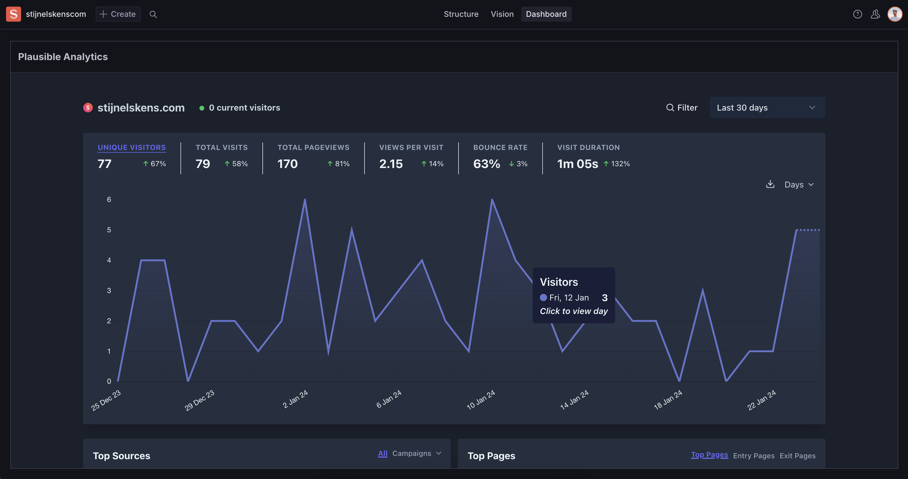

# sanity-plugin-plausible-analytics

> This is a **Sanity Studio v3** plugin.
> Inspired by https://www.sanity.io/plugins/plausible-iframe for v2.



## Plausible configuration

- Create a shared link without password protection.
- Add the shared link to the plugin configuration.

## Installation

```sh
npm install sanity-plugin-plausible-analytics
```

## Usage

Add it as a plugin inside the dashboardTool in `sanity.config.ts` (or .js):

```ts
import {defineConfig} from 'sanity'
import {dashboardTool} from '@sanity/dashboard'
import {plausibleWidget} from 'sanity-plugin-plausible-analytics'

export default defineConfig({
  //...

  plugins: [
    dashboardTool({
      widgets: [
        plausibleWidget({
          url: '<https://plausible.io/share/your-project?auth=xxxx>',
        }),
      ],
    }),
  ],
})
```

### Options

`url` - Required - the shared link from plausible
`title` - Optional - defaults to 'Plausible Analytics'
`height` - Optional - defaults to 'calc(100vh - 143px)'

## License

[MIT](LICENSE) © Stijn

## Develop & test

This plugin uses [@sanity/plugin-kit](https://github.com/sanity-io/plugin-kit)
with default configuration for build & watch scripts.

See [Testing a plugin in Sanity Studio](https://github.com/sanity-io/plugin-kit#testing-a-plugin-in-sanity-studio)
on how to run this plugin with hotreload in the studio.
